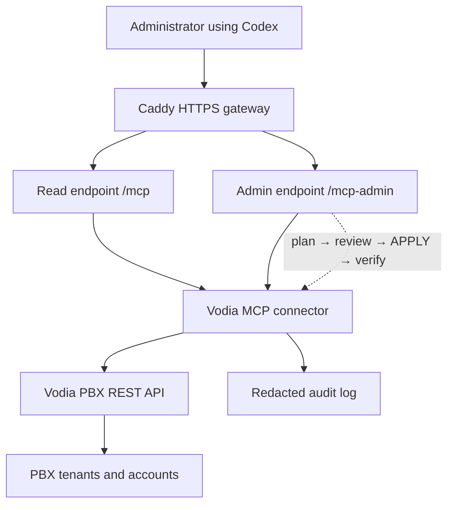

# Vodia MCP 0.7

## Deployment, Codex setup, operations, and prompt guide

| Guide | Value |
|---|---|
| Release | 0.7.0 test release |
| Target PBX | Vodia PBX 70.x |
| API catalog | Vodia REST API 70.3 — 299 operations: 200 GET, 63 POST, 3 PUT, 33 DELETE |
| Audience | PBX administrators, support engineers, and controlled testers |
| Updated | August 10, 2026 |

> **Purpose:** Connect Codex to a multitenant Vodia PBX for inventory, statistics, call troubleshooting, SIP/PCAP analysis, and carefully approved administrative changes.
>
> **Test-release boundary:** This build uses shared bearer tokens, not OAuth 2.1 or per-human identity. Use it in a controlled environment, rotate tokens after testing, and keep destructive and elevated actions disabled.

## What the operator gets

- A strict read-only MCP endpoint for routine support and reporting.
- A separate controlled-admin endpoint for plan/review/apply changes.
- System-wide tenant visibility when the tenant allowlist is intentionally left blank.
- Redacted audit records for reads, plans, writes, and SIP-trace access.
- A prompt library that limits sensitive output and accidental writes.

## 1. Architecture and operating model



Codex does not talk directly to the PBX. It calls the HTTPS MCP connector. The connector validates tenant scope, maps approved tool calls to declared Vodia REST operations, redacts secrets, and writes an audit record.

### Endpoint roles

| Endpoint | Role | Approval policy |
|---|---|---|
| `/mcp` | Strict read-only diagnostics and reporting | `auto` |
| `/mcp-admin` | Reads plus planned, explicitly approved writes | `writes` |
| `/admin/` | Connector dashboard | Dashboard token |
| `/health` | Non-sensitive service health | No token |

### Write lifecycle

1. Codex calls a planner such as `plan_extension_pcap` or `plan_vodia_change`.
2. The connector validates policy, tenant, operation, parameters, and current preimage.
3. The operator reviews the proposed change and its expiring `change_id`.
4. A separate `apply_vodia_change` call requires the literal confirmation `APPLY`.
5. Codex displays a tool-approval request; the operator approves it once after checking the target.
6. The connector applies the unchanged plan, verifies state when possible, and audits the result.

> **Hard stop:** A missing, expired, previously used, or stale plan does not write. If PBX state changed after planning, create a new plan.

## 2. Requirements and preflight

### Infrastructure

- Ubuntu or Debian connector host with Node.js 18 or newer.
- DNS A/AAAA record for the public MCP hostname pointing to the connector host.
- Inbound TCP 80 and 443. Restrict SSH/Instance Connect to administrators.
- Do **not** expose TCP 3100 publicly. Node binds to `127.0.0.1`; Caddy proxies HTTPS.
- Vodia PBX 70.x reachable over HTTPS from the connector host.
- Dedicated Vodia system-administrator API account for all-tenant testing, or a least-privilege tenant-scoped account.

### DNS and network checks

```bash
getent hosts YOUR-MCP-DOMAIN
curl -I https://YOUR-PBX-DOMAIN
sudo ss -ltnp | grep -E ':80|:443|:3100'
```

> Leave the installer's allowed-tenant prompt blank only when the tester requires visibility across every PBX tenant. Enter a comma-separated allowlist for a limited deployment.

### Package

- Download: [vodia-mcp-v0.7.0-test.zip](https://raw.githubusercontent.com/rebelking/vodia-downloads/main/vodia-mcp-v0.7.0-test.zip)
- Repository: [rebelking/vodia-downloads](https://github.com/rebelking/vodia-downloads)
- SHA-256: `02a5691e460cce9ac2bfe2cfaee8a12a4d4414d9cda060fc63bc526286fa47f9`

## 3. Download and install

### Step 1 — Download and verify

```bash
cd /home/ubuntu
wget -O vodia-mcp-v0.7.0-test.zip \
  https://raw.githubusercontent.com/rebelking/vodia-downloads/main/vodia-mcp-v0.7.0-test.zip

echo '02a5691e460cce9ac2bfe2cfaee8a12a4d4414d9cda060fc63bc526286fa47f9  vodia-mcp-v0.7.0-test.zip' \
  | sha256sum -c -
```

### Step 2 — Back up an existing connector

```bash
sudo cp /etc/vodia-mcp.env /etc/vodia-mcp.env.before-v0.7
sudo cp -a /opt/vodia-mcp /opt/vodia-mcp.before-v0.7
```

Skip this on a new host. Check free disk space before copying an installed `node_modules` directory.

### Step 3 — Extract and run the installer

```bash
release='/home/ubuntu/vodia-mcp-v0.7.0-test.zip'
test_dir="$(mktemp -d /tmp/vodia-mcp-v0.7-test.XXXXXX)"
unzip -q "$release" -d "$test_dir"

sudo env \
  VODIA_MCP_PACKAGE_FILE="$release" \
  VODIA_MCP_ROTATE_TOKENS='true' \
  bash "$test_dir/vodia-mcp/install-vodia-mcp.sh"
```

### Installer answers

| Prompt | Example or decision |
|---|---|
| Public MCP domain | `mcp-test.tryvodia.com` |
| Vodia PBX URL | `https://vodiatech.audiomercy.com` |
| Dedicated API username | Dedicated PBX system API account |
| Allowed tenant domains | Blank = all tenants; otherwise comma-separated domains |
| Vodia API password | Enter privately; never paste into tickets or chats |

If installation stops with `caddy.service is not active, cannot reload`, run:

```bash
sudo systemctl enable --now caddy
```

Then rerun the same installer command. Disregard credentials printed by an incomplete run; the final successful run creates the valid credential set.

## 4. Credential map

| Secret | Used for | Where it belongs |
|---|---|---|
| Vodia API password | Connector authenticates to PBX | `/etc/vodia-mcp.env` only |
| Dashboard token | `https://MCP-DOMAIN/admin/` | Administrator password manager |
| Read MCP token | `https://MCP-DOMAIN/mcp` | `VODIA_TEST_MCP_TOKEN` on the Codex computer |
| Admin MCP token | `https://MCP-DOMAIN/mcp-admin` | `VODIA_TEST_MCP_ADMIN_TOKEN` on the Codex computer |

> **Never swap tokens:** The dashboard token is not an MCP token. The read token cannot call admin-only tools. Never assign the admin MCP token to the read-token environment variable.

The installer saves a root-only copy:

```bash
sudo stat -c '%A %U:%G %n' /root/vodia-mcp-credentials.txt
sudo cat /root/vodia-mcp-credentials.txt
```

Expected mode is `0600`. View it only in a private administrator session. Never paste the file into chat, email, tickets, or screenshots.

Rotate tokens after exposure, testing, handoff, or cloning an image. Then update the Windows user environment variables and restart Windows so the Codex desktop process inherits them.

### Authentication limitation

v0.7 uses shared bearer tokens. It does not provide OAuth 2.1, per-user authorization, or distinct human identity. The admin audit actor defaults to `MCP_ADMIN_ACTOR`. Do not describe this release as production multi-user identity.

## 5. Validate the Linux deployment

```bash
sudo systemctl daemon-reload
sudo systemctl restart vodia-mcp
sudo systemctl enable --now caddy
sudo systemctl reload caddy

sudo systemctl status vodia-mcp caddy --no-pager
curl -fsS http://127.0.0.1:3100/health
curl -fsS https://YOUR-MCP-DOMAIN/health
node -p "require('/opt/vodia-mcp/package.json').version"
sudo ss -ltnp | grep ':3100'
```

Expected:

- Version: `0.7.0`
- Health mode: `read-only+controlled-admin`
- Listener: `127.0.0.1:3100`, never `0.0.0.0:3100`

### Audit file

```bash
sudo stat -c '%A %U:%G %n' /var/log/vodia-mcp/audit.jsonl
sudo tail -n 20 /var/log/vodia-mcp/audit.jsonl
```

Expected ownership is `vodiamcp:vodiamcp` and mode is `0600`. Audit records must not contain bearer tokens, PBX passwords, license keys, or SIP `Authorization` values.

### Firewall

| Port | Source | Purpose |
|---|---|---|
| 22 | Administrator IP / Instance Connect | SSH administration |
| 80 | Internet | ACME challenge and redirect |
| 443 | Authorized users / Internet | HTTPS MCP and dashboard |
| 3100 | No public inbound rule | Local Caddy-to-Node proxy only |

## 6. Configure Codex on Windows

### Step 1 — Store the tokens safely

Run in Windows PowerShell. This avoids putting tokens directly in command history.

```powershell
$secureRead = Read-Host "Paste read-only MCP token" -AsSecureString
$readPlain = [System.Net.NetworkCredential]::new("", $secureRead).Password
[Environment]::SetEnvironmentVariable("VODIA_TEST_MCP_TOKEN", $readPlain, "User")

$secureAdmin = Read-Host "Paste administrator MCP token" -AsSecureString
$adminPlain = [System.Net.NetworkCredential]::new("", $secureAdmin).Password
[Environment]::SetEnvironmentVariable("VODIA_TEST_MCP_ADMIN_TOKEN", $adminPlain, "User")

Remove-Variable secureRead,readPlain,secureAdmin,adminPlain
```

### Step 2 — Add the MCP definitions

```powershell
$configPath = Join-Path $env:USERPROFILE ".codex\config.toml"
Copy-Item $configPath "$configPath.before-vodia-v07.bak" -Force
notepad $configPath
```

Append the following. Replace `YOUR-MCP-DOMAIN`; never place token values in `config.toml`.

```toml
[mcp_servers.vodia_test]
url = "https://YOUR-MCP-DOMAIN/mcp"
bearer_token_env_var = "VODIA_TEST_MCP_TOKEN"
enabled = true
required = true
default_tools_approval_mode = "auto"

[mcp_servers.vodia_test_admin]
url = "https://YOUR-MCP-DOMAIN/mcp-admin"
bearer_token_env_var = "VODIA_TEST_MCP_ADMIN_TOKEN"
enabled = true
required = true
default_tools_approval_mode = "writes"
```

> Keep the read server on `auto` and the admin server on `writes`. Never configure `/mcp-admin` for automatic write approval.

### Step 3 — Verify without displaying tokens

```powershell
$readLength = ([Environment]::GetEnvironmentVariable("VODIA_TEST_MCP_TOKEN", "User")).Length
$adminLength = ([Environment]::GetEnvironmentVariable("VODIA_TEST_MCP_ADMIN_TOKEN", "User")).Length
"Read token length: $readLength"
"Admin token length: $adminLength"
```

Both should be `64`. Restart Windows after creating the user environment variables; closing one Codex window may leave a background process with the old environment.

### Step 4 — Locate Codex CLI and list servers

```powershell
$codexPath = Get-ChildItem "$env:LOCALAPPDATA\OpenAI\Codex\bin" `
  -Recurse -Filter codex.exe -File |
  Sort-Object LastWriteTime -Descending |
  Select-Object -First 1 -ExpandProperty FullName

& $codexPath mcp list
```

Expected entries: `vodia_test` and `vodia_test_admin`.

## 7. Acceptance tests

Paste these prompts into Codex one at a time.

### Read connector

```text
Using only vodia_test, call get_connector_info. Return only the connector version, access mode, tenant-restriction status, and API operation counts. Do not display credentials or private configuration.
```

### Admin connector without a write

```text
Using only vodia_test_admin, call get_connector_info and find_api_capabilities. Do not plan or perform any write. Return the connector version, Vodia API version, catalog counts, and whether destructive and elevated actions are enabled.
```

### All-tenant visibility

```text
Using only vodia_test, call list_domains. Return the total tenant count and tenant domains. Do not display passwords, tokens, or private configuration.
```

### Tenant counts

```text
Using only vodia_test, test list_accounts, list_extensions, list_registrations, list_queues, list_ring_groups, and list_auto_attendants for tenant TENANT-DOMAIN. Return a PASS or FAIL table with record counts only.
```

When the installer allowlist is blank, `get_connector_info` should report tenant restrictions disabled. That is expected for a system-administrator test deployment.

## 8. Read-only prompt library

Replace uppercase placeholders before sending a prompt.

### System and tenants

| Goal | Prompt |
|---|---|
| PBX version and build | `Using only vodia_test, call get_system_status. Return the PBX version, platform, build date, and overall health. Do not display private configuration.` |
| License capacity | `Using only vodia_test, call get_system_license. Summarize licensed capacity, current usage, and limit warnings. Do not display license keys or authentication material.` |
| Performance | `Using only vodia_test, call get_system_stats. Summarize CPU, memory, active calls, registrations, and quality indicators. Flag abnormal values and separate confirmed data from inference.` |
| Tenant inventory | `Using only vodia_test, call list_domains. Return each tenant domain and non-sensitive status fields. Do not expose administrator details or credentials.` |
| Audit summary | `Using only vodia_test_admin, call get_system_audit_log for the most recent 100 records. Summarize by tenant, administrator, action type, and time. Redact account numbers and private values.` |
| Discover capability | `Using only vodia_test_admin, call find_api_capabilities with query 'KEYWORDS'. Return operation IDs, methods, paths, risk classifications, and whether each operation is callable. Do not perform any operation.` |

### Accounts, extensions, and registrations

| Goal | Prompt |
|---|---|
| Find extension | `Using only vodia_test, call find_extension_across_tenants for extension EXTENSION. Return matching tenant domains, account type, and registration state. Do not display names, phone numbers, SIP passwords, or authentication material.` |
| Account inventory | `Using only vodia_test, call list_accounts for tenant TENANT-DOMAIN. Group counts by account type: extensions, queues, ring groups, auto attendants, conferences, service flags, and other routing accounts.` |
| Extension settings | `Using only vodia_test, call get_extension_settings for extension EXTENSION in tenant TENANT-DOMAIN. Summarize forwarding, DND, mailbox, registration, recording, and PCAP-related settings. Redact passwords, PINs, phone numbers, and authentication material.` |
| Registrations | `Using only vodia_test, call list_registrations for tenant TENANT-DOMAIN. Return counts by transport, device type, registration status, and age. Redact IP addresses, user agents, account numbers, and contact URIs.` |
| Registration history | `Using only vodia_test, call get_extension_registration_history for EXTENSION@TENANT-DOMAIN. Build a chronological summary of successes, failures, expiration events, and transport changes. Redact credentials.` |
| Extension syslog | `Using only vodia_test, call get_extension_syslog for EXTENSION@TENANT-DOMAIN. Summarize registration, call setup, media, provisioning, and errors chronologically. Separate confirmed events from possible causes.` |
| Call history | `Using only vodia_test, call get_extension_call_history for EXTENSION@TENANT-DOMAIN. Return counts and a redacted timeline grouped into inbound, outbound, internal, answered, missed, rejected, and failed calls.` |
| Voicemail metadata | `Using only vodia_test, call get_voicemail_metadata for EXTENSION@TENANT-DOMAIN with page 1, size 25, and unread_only=false. Return message counts, timestamps, and read state only. Do not retrieve audio or display caller phone numbers.` |

### Routing and live status

| Goal | Prompt |
|---|---|
| Routing inventory | `Using only vodia_test, call list_trunks, list_dialplans, list_queues, list_ring_groups, list_auto_attendants, list_conferences, and list_service_flags for tenant TENANT-DOMAIN. Return record counts and identify empty categories. Do not display trunk passwords or private routing targets.` |
| Live extensions | `Using only vodia_test, call get_live_extension_status for tenant TENANT-DOMAIN. Return counts by registered, unregistered, busy, ringing, DND, and unavailable state. Do not display extension numbers or names.` |
| Live queues | `Using only vodia_test, call get_live_queue_status for tenant TENANT-DOMAIN. Summarize callers waiting, longest wait, logged-in agents, available agents, active calls, and service-level warnings by queue. Redact caller IDs.` |
| Ring groups/conferences | `Using only vodia_test, call get_live_ring_group_status and get_live_conference_status for tenant TENANT-DOMAIN. Return active-object counts and non-sensitive state summaries.` |
| Service flags | `Using only vodia_test, call list_service_flags for tenant TENANT-DOMAIN. Return current state, schedule state, and next transition when available. Do not display private routing destinations.` |

### CDRs and statistics

| Goal | Prompt |
|---|---|
| Recent calls | `Using only vodia_test, call get_tenant_cdrs for tenant TENANT-DOMAIN with page 1 and size 100. Return totals for answered, abandoned, busy, rejected, failed, inbound, outbound, and internal calls. Redact names and phone numbers.` |
| Specific call | `Using only vodia_test, call get_specific_cdr for call ID CALL-ID in tenant TENANT-DOMAIN. Return timestamps, direction, duration, disposition, SIP response/cause fields, trunk/queue involvement, and whether PCAP is available. Redact phone numbers and identities.` |
| Queue performance | `Using only vodia_test, call get_queue_stats for QUEUE@TENANT-DOMAIN for the last DAYS days. Summarize total, answered, abandoned, redirected, overflowed, transferred, average wait, longest wait, and service level.` |
| Queue CDRs | `Using only vodia_test, call get_queue_cdrs for QUEUE@TENANT-DOMAIN with page 1 and size 500. Analyze hourly volume, answer rate, abandonment, wait-time distribution, and agent handling. Redact callers and agents.` |
| Tenant quality | `Using only vodia_test, call get_tenant_stats for tenant TENANT-DOMAIN. Summarize call volume, failures, MOS/quality indicators, and time-based anomalies. Label fields the PBX did not provide.` |
| Trunk quality | `Using only vodia_test, call get_trunk_stats for tenant TENANT-DOMAIN and trunk TRUNK-ID. Summarize attempts, completions, failures, response codes, duration, and quality indicators. Do not claim causation without evidence.` |

## 9. Dropped calls, SIP logs, and PCAP

### Evidence bundle

```text
Using only vodia_test_admin, call troubleshoot_dropped_call for call ID CALL-ID in tenant TENANT-DOMAIN and extension EXTENSION. Correlate the CDR, tenant log, registration history, extension syslog, tenant statistics, and trunk statistics. Separate confirmed evidence, likely cause, alternative explanations, and missing evidence.
```

### Tenant log

```text
Using only vodia_test, call get_tenant_log for tenant TENANT-DOMAIN. Find entries related to CALL-ID, EXTENSION, or TIMESTAMP. Return a redacted chronological timeline and explain each relevant SIP or routing event.
```

### Retained SIP trace

```text
Using only vodia_test_admin, call get_call_sip_trace for call ID CALL-ID in tenant TENANT-DOMAIN. Return chronological SIP start lines, Call-ID correlation, final response, Reason/Q.850 cause, SDP/media changes, and the message that ended the dialog. Never display SIP Authorization, Proxy-Authorization, cookies, or tokens.
```

> **SIP trace versus PCAP:** PBX logs may allow the connector to reconstruct a redacted SIP dialog even when no PCAP file is returned. Label that evidence as **log-derived SIP trace**, not PCAP. A historical call with `pcap=false` or no retained capture cannot be reconstructed as a packet capture. Enable capture before reproducing the issue, place a short test call, record its call ID, retrieve the evidence, and disable capture.

## 10. Controlled capture and logging changes

### Extension PCAP: plan only

```text
Using only vodia_test_admin, call plan_extension_pcap for extension EXTENSION in tenant TENANT-DOMAIN with enabled=true. Use reason 'Ticket TICKET-ID: temporary capture for call troubleshooting'. Do not call apply_vodia_change. Show the current value, proposed value, change ID, request hash, and expiration.
```

### Apply the reviewed plan

```text
Apply the exact previously displayed change plan using apply_vodia_change with confirmation exactly APPLY. Do not alter the tenant, extension, or requested value. Read the extension settings afterward and verify the PCAP value.
```

### Disable PCAP after testing

```text
Using only vodia_test_admin, plan disabling PCAP for extension EXTENSION in tenant TENANT-DOMAIN. Reason: Ticket TICKET-ID capture completed. Do not apply until I review the plan.
```

### Trunk PCAP: plan only

```text
Using only vodia_test_admin, call plan_trunk_pcap for trunk TRUNK-ID in tenant TENANT-DOMAIN with enabled=true. Use reason 'Ticket TICKET-ID: temporary trunk capture'. Do not apply. Show the preimage, proposed change, change ID, and expiration.
```

### Temporary SIP logging: plan only

```text
Using only vodia_test_admin, call plan_sip_trace_logging for 600 seconds with SIP level 9, media level 7, REGISTER disabled, and SUBSCRIBE/NOTIFY disabled. Use reason 'Ticket TICKET-ID: reproduce dropped call'. Do not apply until I approve the displayed settings.
```

The planner accepts 60–3,600 seconds. Use the shortest useful window, reproduce immediately, and verify automatic restoration afterward.

### SIP analysis prompts

```text
Using only vodia_test_admin, analyze the retained SIP trace for call ID CALL-ID in tenant TENANT-DOMAIN. Explain INVITE routing, provisional responses, authentication challenges, SDP offers/answers, retransmissions, final response, ACK/BYE/CANCEL behavior, and Q.850 cause. Quote only short non-sensitive SIP start lines.
```

```text
Using only vodia_test_admin, compare SIP traces for successful call GOOD-CALL-ID and failed call BAD-CALL-ID in tenant TENANT-DOMAIN. Identify the first meaningful divergence, final causes, routing differences, and media negotiation differences. Redact identities and authentication headers.
```

## 11. Generic controlled administrative changes

> Never ask Codex to discover, plan, and apply an unfamiliar write in one prompt. Discovery, planning, approval, and verification are separate steps.

### 1. Discover

```text
Using only vodia_test_admin, call find_api_capabilities with query 'DESCRIBE THE SETTING'. Return callable POST or PUT operations with operation IDs, paths, required parameters, risk level, and blocked reason if any. Do not plan or perform a change.
```

### 2. Plan

```text
Using only vodia_test_admin, call plan_vodia_change with operation_id OPERATION-ID, the exact required path parameters, query parameters, and body shown below. Reason: TICKET-ID and business justification. Do not apply. Return the preimage, exact request, risk, change ID, request hash, and expiration. BODY: JSON-BODY
```

### 3. Apply exactly what was reviewed

```text
Apply only change_id CHANGE-ID using apply_vodia_change with confirmation exactly APPLY. Do not substitute a different operation, tenant, path, query, or body. Return status and verification read-back.
```

### 4. Verify independently through the read endpoint

```text
Using only vodia_test, independently read the affected object in tenant TENANT-DOMAIN. Return only the changed field, its current value, and whether it matches the approved plan. Do not perform any change.
```

### Disabled by default

- `DELETE` operations require `VODIA_ENABLE_DESTRUCTIVE=true`.
- External actions such as calls, messages, email, fax, uploads, software actions, tokens, and certificates require `VODIA_ENABLE_ELEVATED_WRITES=true`.
- Keep both flags `false` during normal testing and support work.

## 12. Troubleshooting

| Symptom | Cause or fix |
|---|---|
| `Environment variable ... is not set` | Confirm both user-scope token lengths are 64, then restart Windows so Codex inherits them. |
| Only the old `vodia` server appears | Append `vodia_test` and `vodia_test_admin` to `%USERPROFILE%\.codex\config.toml`, save, and run `codex mcp list`. |
| TOML parse error | Remove duplicate `url =`, Markdown links, escaped colons, or duplicate table headers. Restore the `.bak` if needed. |
| `caddy.service is not active` | Run `sudo systemctl enable --now caddy`, validate the Caddyfile, then rerun the installer. |
| Local health fails just after restart | Wait briefly and retry. If it remains down, inspect `systemctl status` and `journalctl`. This is not a firewall issue when testing `127.0.0.1`. |
| Public health fails but local works | Check DNS, inbound ports 80/443, Caddy status, certificate logs, and the hostname in Caddy configuration. |
| HTTP 401 | Wrong/old token or wrong endpoint. Match the read token to `/mcp` and admin token to `/mcp-admin`. |
| Write call cancelled | Nothing changed. Review the approval card and approve only when the planned target is correct. |
| Blank `change_id` | Run the planner first, copy its UUID, and apply within the five-minute TTL. |
| Plan expired or stale | Nothing changed. Read current state and create a new plan. |
| No PCAP file | The PBX has no retained capture or its CDR/PCAP endpoint did not return one. Use log-derived SIP evidence if available, or enable temporary capture and reproduce. |

### Service diagnostics

```bash
sudo systemctl status vodia-mcp caddy --no-pager
sudo journalctl -u vodia-mcp -n 100 --no-pager
sudo journalctl -u caddy -n 100 --no-pager
sudo caddy validate --config /etc/caddy/Caddyfile
sudo ss -ltnp | grep ':3100'
curl -fsS http://127.0.0.1:3100/health
curl -fsS https://YOUR-MCP-DOMAIN/health
```

## 13. Handoff checklist

- [ ] DNS points to the correct connector instance.
- [ ] TCP 80/443 are exposed; TCP 3100 is not.
- [ ] Connector uses a dedicated PBX API account.
- [ ] Intended tenant scope is documented: all tenants or explicit allowlist.
- [ ] v0.7.0 tests, local health, public health, and certificate validation pass.
- [ ] Dashboard, read MCP, and admin MCP tokens are stored separately.
- [ ] Tokens were rotated after exposure and after cloning an image.
- [ ] Codex read endpoint uses approval mode `auto`.
- [ ] Codex admin endpoint uses approval mode `writes`.
- [ ] Elevated and destructive operations remain disabled.
- [ ] Plan-only test, approved change, independent verification, and audit-log check were completed.
- [ ] Tester knows how to disable PCAP and temporary logging after troubleshooting.
- [ ] Rollback backups remain available until acceptance is signed off.

## 14. Production hardening roadmap

- OAuth 2.1 instead of shared bearer tokens.
- Per-user identity, roles, and scopes.
- Tenant restrictions enforced from identity claims.
- Per-user audit attribution and token revocation.
- Vodia MCP plugin packaging and managed distribution.
- Optional embedded queue and registration wallboards.

## Sources

- [Vodia PBX REST API reference](https://doc.vodia.com/api-reference)
- [OpenAI Codex MCP documentation](https://developers.openai.com/codex/mcp)
- [Vodia MCP package repository](https://github.com/rebelking/vodia-downloads)
